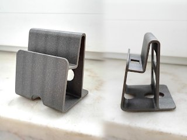
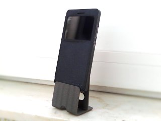
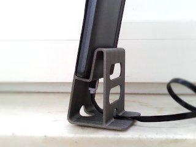
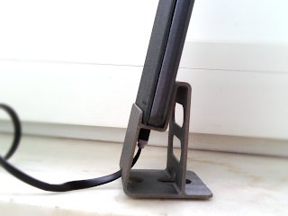
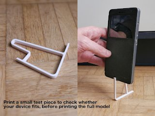

# Customizable Smartphone stand / charging holder
*3D printable desk stand for smartphones and tablets (formerly thing:2847921)*

### License
[Creative Commons - Attribution](https://creativecommons.org/licenses/by/4.0/)

### Gallery

[🔎](images/photo1.jpg) [🔎](images/photo2.jpg) [🔎](images/photo3.jpg) [🔎](images/photo4.jpg)

## Description and Instructions

This is a customizable stand for smartphones, small tablets, calculators, or other thin devices.
If you want, you can configure it to have holes and gaps for routing a USB cable, so you can use the stand while charging your device, assuming it has its USB port exactly in the middle of the bottom (which seems to be quite standard these days).

There is also an option to make it wall-mountable, although this will only really be usable for smaller devices.

This is a **customizable parametric model** made in [OpenSCAD](https://openscad.org/). **[use OpenSCAD's Customizer](https://www.dr-lex.be/3d-printing/customizer.html)** to generate a model tailored to your smartphone or other device. The basic parameters are rather self-explanatory.

- You will need to set the `lift` value high enough to have sufficient room inside the holder to route a cable through the optional front or rear hole. This depends on the type of cable. I recommend a flat kind of USB cable as can be seen in the photos: it is very flexible, the plugs are also generally small and fit through the holes easily. Routing thicker cables with larger plugs through the rear hole may still be possible by first inserting the plug from above, and then inserting it again from below and then straightening the cable. Adding some extra `lift` may help with thicker cables.
- If your charging cable will be coming from the front, enable the `frontGap` option to make it much easier to insert and remove the phone (shown in the second photo). You can opt to include a built-in support into the print that needs to be removed afterwards, or omit this and rely on your slicer's own support generator. If your printer's bridging and cooling parameters are set up correctly, the built-in support should be easy to remove (in my ABS print, it almost popped out spontaneously when it cooled down). If not, a knife should help.
- You may enable the `preview` checkbox to view the model in an upright pose while configuring it. However, *do not print it in this orientation* on a regular FDM printer! It would require supports that can be easily avoided in the sideways position (and it would also look worse, and be weaker).

### First print a test piece

Before printing the entire model, you should verify whether your phone will really fit without having too much margin. To do this, enable the *‘testPiece’* option and set the width to 5. This will produce a quick-to-print slice of the stand, which you can use to check if you don't need to increase or decrease the ‘thick’ value, or increase the ‘lift’ value to offer more room for a cable.

[🔎](images/testpiece.jpg)

### Printing Hints

The model is designed to be printed at 0.2 mm layer height, although you could also print it at finer heights. (If you wonder what causes the stripes on the photos of my print, it is because it was printed with variable layer height: the silver filament I used looks slightly darker where the layers are thinner.)

This prints easily without supports if you did not enable the front or rear bottom holes. If they are enabled, you can still print without supports, but the holes may be a bit messy. It helps a lot to apply enough cooling while the upper part of the holes is being printed. It also helps to reduce layer height around this zone (if you can very layer height in specific parts of the print). Of course you can just print it any way you like. You could enable supports to get perfect overhangs, but will greatly increase print time and required material for only a small benefit. The same goes for the `frontGap` option, if the built-in support doesn't work for you, you can disable the included support and let your slicer generate its own, which will probably be less efficient but perhaps more reliable.

Due to the small contact surface, a brim or raft may be recommended especially when using more warp-prone filaments like ABS. When printing in such filament and using the built-in support, it is also highly recommended to enable the `anchorSupport` option.

### Post-printing

If the overhangs came out a bit messy, they can be easily cleaned up with an Xacto knife.

A few stick-on rubber feet will help keep the holder from shifting around.

## Updates

### 2018/04/02
First upload to Thingiverse.

### 2019/07/21
Version 2: added the option to make a gap in the front for easier inserting with a cable coming from the front. Also fixed an error in the calculations which could cause the model to deform.

### 2024/11/08
Migrated to GitHub.  
Version 2.1: some printability improvements; allow omitting the built-in support.

## Tags
`charger`, `customizable`, `customizer`, `iPhone_stand`, `openscad`, `Phone_Stand`, `smartphone`, `smartphone_holder`, `smartphone_stand`, `stand`, `usb`, `wall_mount`
